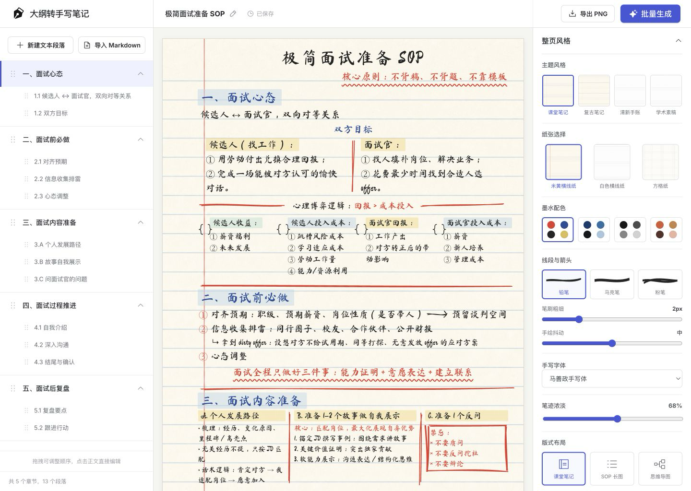

# 大纲转手写笔记

一个可以把结构化大纲整理成手写笔记长图的 React 工具。正文可以直接编辑，并支持切换纸张、字体、配色、排版和手绘笔刷，适合制作课程笔记、SOP、知识卡片与复习资料。



## 主要功能

- 三栏工作台：左侧内容大纲、中间笔记画布、右侧样式设置
- 直接编辑正文，并可导入 Markdown
- 米黄横线纸、白色横线纸、方格纸等纸张样式
- 多种手写字体、墨水配色与 400–700 字重调节
- 铅笔、马克笔、粉笔三种手绘笔刷
- 手绘分隔线、箭头、波浪线和不规则高亮块
- 课堂笔记、SOP 长图、思维导图三种布局
- 高清 PNG 导出和批量 ZIP 生成

## 本地运行

需要 Node.js 18 或更高版本。

```bash
npm install
npm run dev
```

浏览器打开 `http://localhost:5173/`。如需使用固定端口：

```bash
npm run dev -- --port 4173
```

## 构建与测试

```bash
npm run build
npm run test:sites
```

## 关于字体

仓库通过 `@fontsource` 内置马善政手写体、龙藏手写体和站酷快乐体。

界面中另外预留了 6 个本地字体选项，但字体文件不随公开仓库分发。若你拥有相应授权，可以将文件放入 `public/fonts/`：

```text
pingfang-shiguang.ttf
pingfang-shaohua.ttf
pingfang-satuo.ttf
yangren-dongzhu-bold.ttf
pingfang-jiangjun.ttf
pingfang-shoushu.ttf
```

缺少这些文件时，应用仍可正常运行，对应选项会使用系统回退字体。

## 技术栈

React 19、Vite、Rough.js、html-to-image、JSZip 与 Phosphor Icons。

